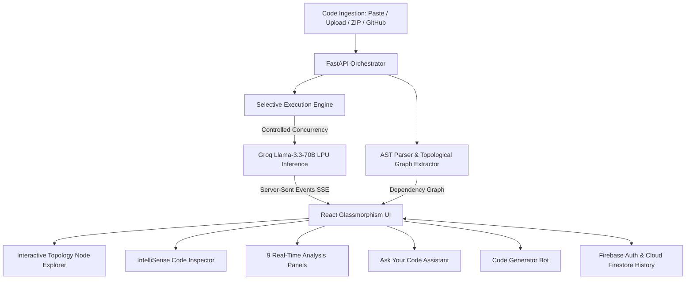

# AI Code Intelligence Platform
## Complete Presentation & Demo Guide

> **Target Audience:** Leadership, Technical Evaluators, Enterprise Clients, Hackathon Judges  
> **Prepared For:** Presentation & Live Demo  
> **System Status:** Fully Deployed & Operational (FastAPI + React/Vite + Groq Llama 3.3 + Firebase)

---

## Executive Summary & Elevator Pitch

> *"Modern software teams spend up to **70% of their time** reading, debugging, auditing, and onboarding into unfamiliar codebases rather than building new features. **AI Code Intelligence** is an enterprise-grade developer companion that transforms any codebase—whether pasted snippets, ZIP archives, or live GitHub repositories—into an interactive, visualized, secure, and self-documenting system with instant architectural maps, security audits, compliance checks, and generative engineering bots."*

### The Core Problem
1. **Developer Ramp-up Friction:** Onboarding new engineers to complex microservices or legacy repositories takes weeks.
2. **Hidden Security & Compliance Debt:** Code vulnerabilities and compliance drift (non-adherence to corporate PRDs and spec sheets) go unnoticed until production outages or audit failures.
3. **Black Box Architectures:** Teams lack real-time visual mental models of module dependencies, class hierarchies, and data flows.
4. **Context-Blind AI Tools:** Generic chat models hallucinate because they lack AST (Abstract Syntax Tree) awareness and repo-wide architectural context.

### The Solution: AI Code Intelligence
An end-to-end full-stack intelligence platform featuring:
- **Instant Code Topology Graphs** (Visual interactive graph nodes)
- **Deep Multi-Pillar Analysis** (Security, Spec Compliance, Refactoring, Big-O Complexity, Architecture)
- **Dual AI Assistants** (Contextual Q&A Chatbot + Production Code Synthesizer)
- **Streaming Real-Time Delivery** with customizable, rate-limit resilient execution.

---

## High-Level Architecture

### Technology Stack Highlights
| Layer | Technologies Used | Key Purpose |
|---|---|---|
| **Frontend** | React 18, Vite, Vanilla CSS (Design Tokens, Glassmorphism, Dark Mode) | High performance, zero bloat, instant visual feedback, responsive layout |
| **Backend** | Python 3.11+, FastAPI, Uvicorn, AST module | High-throughput asynchronous orchestration, syntax parsing, SSE streaming |
| **LLM Inference** | Groq Cloud (`llama-3.3-70b-versatile`) | Blazing fast token generation (~300+ tok/s), high-depth technical reasoning |
| **Data & Auth** | Firebase Authentication (Google OAuth), Cloud Firestore | Persistent multi-user audit history, secure report storage |
| **Visualization**| Interactive Canvas Graph, Mermaid.js integration | Visual node topology and dynamic architecture diagrams |

---

## Comprehensive Feature Breakdown

### 1. Multi-Modal Code Ingestion Engine
* **What it does:** Supports 4 flexible ways to bring code into the system:
  1. Direct text/code paste with automatic language detection.
  2. Single file upload (`.py`, `.js`, `.ts`, `.java`, `.cpp`, `.go`, etc.).
  3. Multi-file or full project **ZIP upload** (automatically unpacks and builds unified code tree).
  4. **GitHub URL Import** (fetches public repo contents directly via GitHub API).
* **Customer Value:** Zero setup friction. Developers don't need to install CLI agents or configure CI/CD pipelines just to understand or audit a repository.

---

### 2. Selective Intelligence Engine (Rate-Limit Resilient & Cost-Optimized)
* **What it does:**
  - Provides a 2-column interactive panel selector before analysis starts.
  - Allows users to selectively toggle any of the 9 intelligence features on or off.
  - Defaults to the core essentials (Explanation, Architecture Diagram, Refactoring, Security Scan) while keeping deep scans (Spec Compliance, Big-O Complexity, Algorithm Optimization) on-demand.
  - Employs an internal async semaphore (`asyncio.Semaphore(2)`) to ensure smooth API execution without hitting LLM rate limits.
* **Customer Value:**
  - **Speed & Agility:** Don't wait for 9 models if you just need a fast security review or architecture diagram.
  - **Enterprise Cost Control:** Lowers token usage by up to 60% per run when running targeted audits.

---

### 3. Codebase Topology Explorer (Interactive Visual Graph)
* **What it does:**
  - Statically analyzes imports, classes, functions, and file relationships using Python's AST parser.
  - Renders an interactive, node-based dependency graph on canvas.
  - Nodes represent files and modules; edges represent dependencies and cross-module calls.
  - Clicking **"Explore Fullscreen"** opens a high-definition modal viewer with zoom, pan, and module inspection capabilities.
* **Customer Value:**
  - **Instant Mental Model:** New developers see how modules connect in 5 seconds instead of spending 3 days digging through directory trees.
  - **Identifies Architectural Spaghetti:** Instantly spot tight coupling, circular dependencies, and monolithic bottlenecks.

---

### 4. Interactive IntelliSense Code Viewer
* **What it does:**
  - Embedded syntax-highlighted code editor interface with line numbers.
  - Symbol inspection: hover over functions, classes, and imports to view structural metadata.
  - Visual bridge between the code and the AI analysis panels.
* **Customer Value:** Eliminates tab-switching between an IDE, documentation, and browser. Context remains unified on one screen.

---

### 5. The 9-Pillar Deep Analysis Suite (Streaming Real-Time Delivery)
Results stream in dynamically using **Server-Sent Events (SSE)** so the user never stares at a dead loading screen.

#### Pillar 1: Plain-English Executive Summary & Explanation
- Breaks down complex code into clean, readable explanations.
- Describes primary responsibilities, input/output contracts, and side-effects.
- **Value:** Non-technical project managers, QA engineers, and cross-functional teams can understand any codebase immediately.

#### Pillar 2: Dynamic Architecture & Flow Diagram
- Automatically generates live **Mermaid.js sequence and component diagrams**.
- Displays how data travels from ingestion to business logic and output.
- **Value:** Zero manual documentation drift. Architecture diagrams are always accurate to the exact code running in production.

#### Pillar 3: API & Developer Documentation
- Produces clean Markdown documentation formatted with parameter types, exceptions, return contracts, and curl/SDK usage examples.
- **Value:** Cuts manual documentation time to zero.

#### Pillar 4: Automated Refactoring & Bug Detection
- Identifies anti-patterns, code smells, dead code, edge-case unhandled exceptions, and unoptimized logic.
- Provides concrete, side-by-side **before/after code diff suggestions**.
- **Value:** Drastically reduces bug escape rate into QA and production.

#### Pillar 5: Algorithmic Complexity Analysis (Big-O)
- Measures worst-case and average-case Time and Space complexity ($O(N)$, $O(N \log N)$, $O(1)$, etc.).
- Points out nested loops, memory leaks, and quadratic scaling traps.
- **Value:** Prevents performance degradation under high enterprise data volumes.

#### Pillar 6: Performance & Algorithm Optimization
- Recommends modern data structures, caching layers, vectorized operations, or async patterns.
- Supplies rewritten, optimized algorithms ready to copy-paste.
- **Value:** Direct infrastructure cost savings (reduces cloud CPU/RAM requirements).

#### Pillar 7: Spec Sheet & Enterprise Standards Compliance Scan
- Compares the codebase against enterprise PRD/Spec requirements provided by the user.
- Highlights what features are **Complete**, **Partially Done**, or **Missing**.
- Flags non-compliance with corporate code conventions.
- **Value:** Bridges the gap between Product Management and Engineering. No more missing requirements at release time.

#### Pillar 8: Enterprise Security Vulnerability Scan
- Scans for OWASP Top 10 risks: SQL injection, path traversal, hardcoded API secrets/credentials, insecure deserialization, unsafe subprocess calls, and input sanitization gaps.
- Renders severity badges (🔴 Critical, 🟠 High, 🟡 Medium) with remediation instructions.
- **Value:** Catches dangerous vulnerabilities prior to PR merge and formal penetration testing.

#### Pillar 9: Next Actions & Agile Backlog Generator
- Synthesizes the findings into prioritized, actionable engineering tickets.
- Categorized by bug fixes, test coverage additions, technical debt, and feature extensions.
- **Value:** Engineering managers and tech leads can export findings directly into sprint planning.

---

### 6. "Ask Your Code" RAG AI Assistant (Bottom-Right Chatbot)
* **What it does:**
  - Accessible via floating bubble on the bottom-right of the screen.
  - Multi-turn conversation powered by repo-contextual retrieval.
  - Users can ask natural questions: *"Where is authentication validated?"*, *"How does error handling work in the payment service?"*, *"What happens if the input is empty?"*
* **Customer Value:** Like having the original software architect sitting next to you 24/7 explaining decisions and edge cases.

---

### 7. AI Code Generator Bot (Bottom-Left Synthesis Bot `🪄`)
* **What it does:**
  - Distinct Emerald-themed floating assistant specifically engineered to **generate production code** matching the analyzed project's style and abstractions.
  - Includes quick-action preset chips:
    - `+ REST Endpoint` (Synthesizes new API routes with Pydantic validation)
    - `+ Integration Handler` (Creates third-party API webhooks & connectors)
    - `+ DB Model` (Creates SQLAlchemy/Prisma schemas)
    - `+ React Hook / UI Component` (Generates frontend counterparts)
    - `+ Auth Middleware` (Creates JWT or role-based permission guards)
  - Features copy-to-clipboard buttons and clean Markdown code blocks.
* **Customer Value:** 10x acceleration for feature development. Generates code that *actually fits* the existing project rather than generic boilerplates.

---

### 8. Cloud History & Enterprise Audit Persistence
* **What it does:**
  - Integrated with **Firebase Authentication** for secure user login.
  - Automatically saves every analysis session to **Google Cloud Firestore**.
  - History sidebar lets users review past codebase audits, track improvements over time, and recall past architectural snapshots.
* **Customer Value:** Audit trail for compliance, easy knowledge sharing across engineering teams.

---

## Competitive Differentiation

| Feature / Capability | Generic AI (ChatGPT / Claude) | GitHub Copilot / Cursor | **Our AI Code Intelligence Platform** |
|---|:---:|:---:|:---:|
| **Whole-Codebase Topology Graph** | ❌ No | ❌ No | **✅ Yes (Interactive Canvas & Fullscreen)** |
| **Spec Sheet vs Code Compliance** | ❌ Manual prompt required | ❌ No | **✅ Yes (Dedicated Audit Pillar)** |
| **Security Audit with Severity Scoring**| ⚠️ Generic text | ⚠️ Inline suggestions only | **✅ Yes (Categorized OWASP scan & remediation)** |
| **Dynamic Architecture Diagramming** | ❌ Plain text only | ❌ No | **✅ Yes (Mermaid.js dynamic rendering)** |
| **Selective Execution & Rate-Limit Control** | ❌ N/A | ❌ N/A | **✅ Yes (Modular panel selection + async throttling)** |
| **Multi-Modal Input (Paste, File, ZIP, GitHub)** | ⚠️ Text paste only | ⚠️ Local IDE files only | **✅ Yes (All 4 modes supported)** |
| **Dual-Bot Synergy (Q&A + Code Generation)**| ⚠️ Single chat window | ⚠️ Inline autocomplete | **✅ Yes (Dedicated Q&A Bot + Synthesis Bot)** |
| **Audit History & Cloud Storage** | ❌ Chat history only | ❌ No | **✅ Yes (Firebase Auth + Firestore snapshots)** |

---

## Live Presentation & Demo Flow (5-Minute Script)

### Step 1: The Hook & Ingestion (1 min)
1. **Show the UI:** Highlight the sleek, modern dark-mode glassmorphism interface.
2. **Action:** Select **GitHub URL** or **ZIP Upload** (or paste a multi-module Python/JS script).
3. **Point out the Customization Grid:** Show the 9-panel checkbox selector. Explain: *"In production environments, developers don't want to waste compute. We give teams granular control to choose exactly which intelligence audits to run."*
4. **Click:** `Analyze Codebase`.

### Step 2: Streaming Intelligence & Visual Topology (1.5 min)
1. **Watch Panels Stream In:** Note how panels render in real-time via Server-Sent Events (SSE) without blocking the UI.
2. **Show the Codebase Topology Graph:**
   - Hover over nodes to show file modules and dependencies.
   - Click **"Explore Fullscreen"** to show the high-impact visual modal.
   - *Key Talking Point:* *"Instead of reading thousands of lines to understand how this system is constructed, any engineer can visually understand the entire architecture immediately."*
3. **Show the Architecture Diagram:** Point out the dynamically rendered Mermaid diagram illustrating component interactions.

### Step 3: Enterprise Value: Security, Specs & Refactoring (1.5 min)
1. **Show the Security Audit Panel:** Highlight detected vulnerabilities, severity tags, and exact remediation code.
2. **Show the Spec Compliance Panel:** Show how it checks the code against product specifications, flagging missing business logic.
3. **Show Complexity & Refactoring:** Point out the Big-O time/space evaluation and side-by-side refactoring diffs.
4. *Key Talking Point:* *"This isn't just an autocomplete tool. It acts as an automated Senior Staff Engineer and Security Auditor on every pull request."*

### Step 4: The Dual AI Assistants & Code Generation (1 min)
1. **Ask Your Code Bot (Bottom-Right):**
   - Click the chat bubble and ask: *"How does the error handling in this module work?"*
   - Show how it answers with deep awareness of the analyzed code.
2. **AI Code Generator Bot (Bottom-Left `🪄`):**
   - Click the magic wand bot.
   - Click the `+ REST Endpoint` or `+ Auth Middleware` chip.
   - Hit Generate: watch it output a fully implemented, ready-to-use code module that respects the project's exact variable names and design patterns.
3. **Wrap up:** Show the **Saved History** tab to prove enterprise multi-session persistence.

---

## Anticipated Questions & Answers (Q&A Prep)

#### Q1: "How does this handle rate limits and large codebases?"
> **Answer:** *"We designed our backend with enterprise resilience:
> 1. **Modular panel selection:** Users run only the analyses they need.
> 2. **Asynchronous Semaphore:** Background LLM calls are throttled to prevent API rate limits.
> 3. **AST Pruning:** Large repositories are parsed into structured abstract syntax trees to extract high-signal symbols, classes, and call graphs, ensuring we feed high-density context into the model without blowing context windows."*

#### Q2: "Can this be deployed privately on-premise without sending code to third parties?"
> **Answer:** *"Yes. Our backend orchestrator is completely decoupled from the inference provider. While we currently use Groq's LPUs for ultra-low latency, the LLM client can be swapped with self-hosted open-source models (e.g., Llama 3 via vLLM or Ollama) or private enterprise VPC endpoints (such as IBM watsonx.ai or AWS Bedrock) with zero changes to the core architecture."*

#### Q3: "What makes this different from GitHub Copilot?"
> **Answer:** *"Copilot is an inline code-completion tool designed for while you write code. AI Code Intelligence is a **system-level comprehension, auditing, and architectural platform**. It provides full codebase topological graphs, spec sheet verification, OWASP vulnerability scans, dynamic architecture diagrams, and persistent compliance audits that individual IDE extensions do not offer."*

#### Q4: "How does the Code Generator Bot ensure compatibility with existing code?"
> **Answer:** *"Unlike generic ChatGPT prompts where the model hallucinates external patterns, our Code Generator Bot is supplied with the extracted symbols, framework versions, and design patterns of the active codebase in its system prompt. The resulting code imports the project's real utilities, matches existing naming conventions, and integrates cleanly."*

---

## Summary Checklist for Tomorrow's Presentation

- [x] Backend running on `http://localhost:8000` (FastAPI + Groq)
- [x] Frontend running on `http://localhost:5173` (React + Vite)
- [x] Sample demo code/ZIP ready for instant paste or upload
- [x] Spec sheet sample text ready to demo the Compliance Panel
- [x] Fullscreen Topology Graph tested and verified
- [x] Both bots (Chat Q&A + Code Generator) ready with sample queries
- [x] Firebase session active for history demonstration
