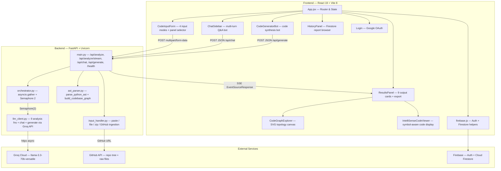

<p align="center">
  <h1 align="center">AI Code Intelligence Platform</h1>
  <p align="center">
    Drop in any codebase — get back architecture graphs, security audits, complexity analysis, and two AI assistants that actually understand your code.
  </p>
</p>

<p align="center">
  
  
  
  
  
  
  
</p>

---

## 🎯 What It Does

**AI Code Intelligence** is a full-stack developer tool that accepts source code via paste, file upload, ZIP archive, or GitHub URL — then runs up to 9 concurrent LLM-powered analyses (explanation, architecture diagrams, API docs, refactoring, Big-O complexity, algorithm optimisation, spec compliance, security scan, and next actions). 

Results stream to the browser in real time via SSE. An interactive topology graph visualises file/class/function relationships extracted from the AST, and two floating AI chatbots let you ask questions about the code or generate new features that match the existing codebase's style.

---

## 📋 Table of Contents

- [What It Does](#-what-it-does)
- [Key Features](#-key-features)
- [Architecture](#-architecture)
- [Tech Stack](#-tech-stack)
- [Getting Started](#-getting-started)
- [Project Structure](#-project-structure)
- [API Reference](#-api-reference)
- [Configuration](#-configuration)
- [Roadmap](#-roadmap)
- [Contributing](#-contributing)
- [License](#-license)
- [Author](#-author)

---

## ✨ Key Features

### Code Ingestion
- **Paste** — auto-detects language from 14+ signatures (Python, JS, TS, Java, Go, Ruby, C#, C/C++, HTML, CSS, JSON, YAML, Markdown)
- **File upload** — any single source file with whitelisted extension
- **ZIP archive** — auto-extracts, filters by extension, respects a ~320K character budget
- **GitHub URL** — fetches up to 200 files via the GitHub Trees API; supports branch/subdirectory paths and private repos via `GITHUB_TOKEN`

### 9-Panel Analysis Suite
Each panel is an independent LLM call. Users select which panels to run before submitting — unselected panels are skipped (zero tokens spent).

| Panel | What It Produces |
|-------|-----------------|
| **Explanation** | Plain-language summary of what the code does |
| **Architecture Diagram** | Raw Mermaid.js `graph TD` syntax |
| **API Docs** | Markdown documentation for public functions, classes, endpoints |
| **Refactor & Bugs** | Issue list + corrected code |
| **Complexity** | Per-function Big-O table (Time + Space) with explanation |
| **Optimise** | Before/after complexity tables + rewritten code |
| **Compliance** | Checks code against a user-provided spec sheet (requires spec input) |
| **Security Scan** | Vulnerability list + remediation recommendations |
| **Next Actions** | Prioritised checklists for immediate work and tech debt |

### SSE Streaming
The `/api/analyze/stream` endpoint sends each panel result as a named SSE event the moment its LLM call finishes. The frontend renders panels progressively — no waiting for all 9 to complete.

### Codebase Topology Graph
The backend's AST parser extracts files, classes, functions, and imports into a graph of nodes and edges (with relationship types: `contains`, `calls`, `imports`). The frontend renders this as an interactive SVG canvas with pan, zoom, search, type filters, and a detail drawer showing signatures, docstrings, and parameters.

### IntelliSense Code Viewer
A side-by-side code viewer with line numbers that highlights symbols from the topology graph's symbol table. Hovering a known symbol shows its signature, file, line, and docstring in a tooltip. Clicking "Focus in Topology Graph" navigates the graph canvas to that node.

### Dual AI Assistants
- **💬 Ask Your Code** (bottom-right FAB) — multi-turn chat grounded in the analysed code context. Sends up to 8K chars of source as system context.
- **🪄 Code Generator** (bottom-left FAB) — generates new REST endpoints, integration handlers, DB models, React hooks, or auth middleware tailored to the existing codebase. Includes preset prompt chips.

### Authentication & History
Firebase Auth (Google OAuth) gates access. Each completed analysis is saved to Cloud Firestore and can be reloaded from the History panel.

---

## 🏗️ Architecture



---

## 🛠️ Tech Stack

| Layer | Technology | Version | Source |
|-------|-----------|---------|--------|
| Runtime | Python | 3.11+ | — |
| Backend framework | FastAPI | latest | `requirements.txt` |
| ASGI server | Uvicorn (standard) | latest | `requirements.txt` |
| HTTP client | httpx | latest | `requirements.txt` |
| SSE | sse-starlette | latest | `requirements.txt` |
| LLM SDK | groq | latest | `requirements.txt` |
| Frontend framework | React | ^19.2.8 | `package.json` |
| Frontend bundler | Vite | ^8.2.0 | `package.json` |
| Auth & DB | Firebase | ^12.19.0 | `package.json` |
| LLM provider | Groq Cloud (llama-3.3-70b-versatile) | — | `llm_client.py` |

---

## 🚀 Getting Started

### Prerequisites

- Python 3.11+
- Node.js 18+ and npm
- A [Groq API key](https://console.groq.com/keys) (free tier works)
- *(Optional)* A GitHub personal access token for private repo imports
- *(Optional)* A Firebase project for auth and history persistence

### 1. Clone & Setup Backend

```bash
git clone https://github.com/prajwalkv18/ai_code_intelligence.git
cd ai_code_intelligence/ai_code_intelligence

python -m venv venv
# Windows: venv\Scripts\activate
# macOS/Linux: source venv/bin/activate

pip install -r requirements.txt
cp .env.example .env
```

Start the backend:

```bash
uvicorn main:app --reload --port 8000
```

### 2. Setup Frontend

```bash
cd frontend
npm install
npm run dev
```

The Vite dev server starts at `http://localhost:5173`.

---

## 📁 Project Structure

```
ai_code_intelligence/
├── README.md                # Root project README
└── ai_code_intelligence/    # Main application root
    ├── main.py              # FastAPI app — all endpoints defined here
    ├── orchestrator.py      # Concurrent LLM dispatch with asyncio.Semaphore(2)
    ├── llm_client.py        # Groq API wrappers for 9 panels + chat + generate
    ├── ast_parser.py        # Python AST parsing + multi-language topology graph builder
    ├── input_handler.py     # Code extraction: paste, file, zip, GitHub URL
    ├── requirements.txt     # Python dependencies
    ├── .env.example         # Template for environment variables
    └── frontend/
        ├── src/
        │   ├── App.jsx                  # Root layout & routing
        │   ├── CodeInputForm.jsx        # 4-mode input + panel selector
        │   ├── ResultsPanel.jsx         # 9 panel output grid & exports
        │   ├── CodeGraphExplorer.jsx    # Interactive SVG topology graph
        │   ├── IntelliSenseCodeViewer.jsx # Symbol hover & line viewer
        │   ├── ChatSidebar.jsx          # "Ask Your Code" AI chat
        │   └── CodeGeneratorBot.jsx     # Code generator bot
        ├── package.json
        └── vite.config.js
```

---

## 📝 License

This project is licensed under the MIT License.

---

## 👤 Author

**Prajwal K V**
- GitHub: [@prajwalkv18](https://github.com/prajwalkv18)
- LinkedIn: [prajwalkv18](https://linkedin.com/in/prajwalkv18)
