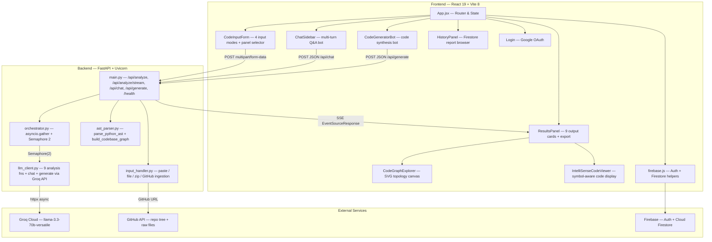

<p align="center">
  <h1 align="center">AI Code Intelligence</h1>
  <p align="center">
    Drop in any codebase — get back architecture graphs, security audits, complexity analysis, and two AI assistants that actually understand your code.
  </p>
</p>

<p align="center">
  
  
  
  
  
  
  
</p>

---

## What It Does

AI Code Intelligence is a full-stack developer tool that accepts source code via paste, file upload, ZIP archive, or GitHub URL — then runs up to 9 concurrent LLM-powered analyses (explanation, architecture diagrams, API docs, refactoring, Big-O complexity, algorithm optimisation, spec compliance, security scan, and next actions). Results stream to the browser in real time via SSE. An interactive topology graph visualises file/class/function relationships extracted from the AST, and two floating AI chatbots let you ask questions about the code or generate new features that match the existing codebase's style.

---

## Demo

<!-- TODO: Drop your screenshots into docs/screenshots/ and update the paths below -->

| View | Screenshot |
|------|-----------|
| Code Input & Panel Selector |  |
| Streaming Analysis Panels |  |
| Codebase Topology Graph |  |
| IntelliSense Code Viewer |  |
| Chat & Code Generator Bots |  |

> **Note:** Create a `docs/screenshots/` directory and add your screenshots there. The filenames above are placeholders.

---

## Key Features

### Code Ingestion
- **Paste** — auto-detects language from 14+ signatures (Python, JS, TS, Java, Go, Ruby, C#, C/C++, HTML, CSS, JSON, YAML, Markdown)
- **File upload** — any single source file with whitelisted extension
- **ZIP archive** — auto-extracts, filters by extension, respects a ~320K character budget
- **GitHub URL** — fetches up to 200 files via the GitHub Trees API; supports branch/subdirectory paths and private repos via `GITHUB_TOKEN`

### 9-Panel Analysis Suite
Each panel is an independent LLM call. Users select which panels to run before submitting — unselected panels are skipped (zero tokens spent).

| Panel | What It Produces |
|-------|-----------------|
| **Explanation** | Plain-language summary of what the code does |
| **Architecture Diagram** | Raw Mermaid.js `graph TD` syntax |
| **API Docs** | Markdown documentation for public functions, classes, endpoints |
| **Refactor & Bugs** | Issue list + corrected code |
| **Complexity** | Per-function Big-O table (Time + Space) with explanation |
| **Optimise** | Before/after complexity tables + rewritten code |
| **Compliance** | Checks code against a user-provided spec sheet (requires spec input) |
| **Security Scan** | Vulnerability list + remediation recommendations |
| **Next Actions** | Prioritised checklists for immediate work and tech debt |

### SSE Streaming
The `/api/analyze/stream` endpoint sends each panel result as a named SSE event the moment its LLM call finishes. The frontend renders panels progressively — no waiting for all 9 to complete.

### Codebase Topology Graph
The backend's AST parser extracts files, classes, functions, and imports into a graph of nodes and edges (with relationship types: `contains`, `calls`, `imports`). The frontend renders this as an interactive SVG canvas with pan, zoom, search, type filters, and a detail drawer showing signatures, docstrings, and parameters.

### IntelliSense Code Viewer
A side-by-side code viewer with line numbers that highlights symbols from the topology graph's symbol table. Hovering a known symbol shows its signature, file, line, and docstring in a tooltip. Clicking "Focus in Topology Graph" navigates the graph canvas to that node.

### Dual AI Assistants
- **💬 Ask Your Code** (bottom-right FAB) — multi-turn chat grounded in the analysed code context. Sends up to 8K chars of source as system context.
- **🪄 Code Generator** (bottom-left FAB) — generates new REST endpoints, integration handlers, DB models, React hooks, or auth middleware tailored to the existing codebase. Includes preset prompt chips.

### Authentication & History
Firebase Auth (Google OAuth) gates access. Each completed analysis is saved to Cloud Firestore and can be reloaded from the History panel.

### Export
Download all panel outputs as a single Markdown file, or copy all to clipboard.

---

## Architecture



---

## Tech Stack

| Layer | Technology | Version | Source |
|-------|-----------|---------|--------|
| Runtime | Python | 3.11+ | — |
| Backend framework | FastAPI | latest | `requirements.txt` |
| ASGI server | Uvicorn (standard) | latest | `requirements.txt` |
| HTTP client | httpx | latest | `requirements.txt` |
| SSE | sse-starlette | latest | `requirements.txt` |
| Multipart parsing | python-multipart | latest | `requirements.txt` |
| Env vars | python-dotenv | latest | `requirements.txt` |
| LLM SDK | groq | latest | `requirements.txt` |
| Frontend framework | React | ^19.2.8 | `package.json` |
| Frontend bundler | Vite | ^8.2.0 | `package.json` |
| React Vite plugin | @vitejs/plugin-react | ^6.0.4 | `package.json` |
| Auth & DB | Firebase | ^12.19.0 | `package.json` |
| Linter | oxlint | ^1.75.0 | `package.json` |
| LLM provider | Groq Cloud (llama-3.3-70b-versatile) | — | `llm_client.py` |

> **Note:** `requirements.txt` does not pin versions. The versions above reflect the latest compatible releases at time of writing.

---

## Getting Started

### Prerequisites

- Python 3.11+
- Node.js 18+ and npm
- A [Groq API key](https://console.groq.com/keys) (free tier works)
- *(Optional)* A GitHub personal access token for private repo imports
- *(Optional)* A Firebase project for auth and history persistence

### 1. Clone

```bash
git clone https://github.com/prajwalkv18/ai_code_intelligence.git
cd ai_code_intelligence/ai_code_intelligence
```

### 2. Backend Setup

```bash
python -m venv venv
# Windows
venv\Scripts\activate
# macOS / Linux
source venv/bin/activate

pip install -r requirements.txt
```

Create a `.env` file in the `ai_code_intelligence/` directory:

```bash
cp .env.example .env
```

Edit `.env` and fill in your keys (see table below).

Start the backend:

```bash
uvicorn main:app --reload --port 8000
```

### 3. Frontend Setup

```bash
cd frontend
npm install
npm run dev
```

The Vite dev server starts at `http://localhost:5173` and proxies `/api` requests to the backend at `http://localhost:8000`.

### Environment Variables

| Variable | Required | Where to Get It |
|----------|----------|----------------|
| `GROQ_API_KEY` | **Yes** | [console.groq.com/keys](https://console.groq.com/keys) |
| `GROQ_MODEL` | No (default: `llama-3.3-70b-versatile`) | Any Groq-supported model ID |
| `GITHUB_TOKEN` | No | [github.com/settings/tokens](https://github.com/settings/tokens) — needed only for private repos or to raise rate limits |
| `VITE_FIREBASE_API_KEY` | No | Firebase Console → Project Settings → Web app config |
| `VITE_FIREBASE_AUTH_DOMAIN` | No | Same as above |
| `VITE_FIREBASE_PROJECT_ID` | No | Same as above |
| `VITE_FIREBASE_STORAGE_BUCKET` | No | Same as above |
| `VITE_FIREBASE_MESSAGING_SENDER_ID` | No | Same as above |
| `VITE_FIREBASE_APP_ID` | No | Same as above |
| `VITE_FIREBASE_MEASUREMENT_ID` | No | Same as above |

> Firebase variables are optional. Without them, the app skips Firebase initialization — auth is disabled and history won't persist, but analysis still works.

---

## Project Structure

```
ai_code_intelligence/
├── main.py                  # FastAPI app — all endpoints defined here
├── orchestrator.py          # Concurrent LLM dispatch with asyncio.Semaphore(2)
├── llm_client.py            # Groq API wrappers for all 9 panels + chat + generate
├── ast_parser.py            # Python AST parsing + multi-language topology graph builder
├── input_handler.py         # Code extraction: paste, file, zip, GitHub URL
├── requirements.txt         # Python dependencies
├── .env.example             # Template for environment variables
├── PRESENTATION_OVERVIEW.md # Demo guide and feature walkthrough
├── project-plan.md          # Original project plan
└── frontend/
    ├── package.json         # React + Vite + Firebase dependencies
    ├── vite.config.js       # Dev server config with /api proxy and SSE passthrough
    ├── firebase.json        # Firebase Hosting config (deploys dist/)
    ├── index.html           # HTML entry point
    └── src/
        ├── main.jsx                 # React DOM mount
        ├── App.jsx                  # Root component — auth gate, state, layout
        ├── CodeInputForm.jsx        # 4-mode input + 9-panel selector + streaming toggle
        ├── ResultsPanel.jsx         # Output grid, AST card, export bar, view switcher
        ├── CodeGraphExplorer.jsx    # Interactive SVG topology graph with pan/zoom/filter
        ├── IntelliSenseCodeViewer.jsx # Line-numbered code viewer with symbol hover cards
        ├── ChatSidebar.jsx          # "Ask Your Code" floating chat drawer
        ├── CodeGeneratorBot.jsx     # "AI Code Generator" floating drawer
        ├── HistoryPanel.jsx         # Firestore-backed analysis history browser
        ├── Login.jsx                # Google OAuth sign-in card
        ├── firebase.js              # Firebase init + auth + Firestore CRUD
        ├── App.css                  # Topology graph & IntelliSense styles
        └── index.css                # Global resets and base styles
```

---

## API Reference

| Method | Path | Content-Type | Request Body | Response | SSE? |
|--------|------|-------------|-------------|----------|------|
| `POST` | `/api/analyze` | `multipart/form-data` | `input_type` (paste\|file\|zip\|github), `code`, `language?`, `spec_sheet?`, `selected_panels?` (JSON array), `file?` | JSON: `{ status, language_detected, files_analyzed, files_skipped, ast_summary, topology_graph, outputs, code_context, full_code }` | No |
| `POST` | `/api/analyze/stream` | `multipart/form-data` | Same as above | SSE events: `meta` → per-panel events → `done` | **Yes** |
| `POST` | `/api/chat` | `application/json` | `{ code, language, history, message }` | `{ status, reply }` | No |
| `POST` | `/api/generate` | `application/json` | `{ code, language, history, prompt }` | `{ status, reply }` | No |
| `GET` | `/health` | — | — | `{ status, version, llm, google_api_key_set, features }` | No |

<details>
<summary><strong>SSE Event Sequence for <code>/api/analyze/stream</code></strong></summary>

1. **`meta`** — language, files, AST summary, topology graph, code context (sent first so the frontend can render the header and graph immediately)
2. **`explanation`**, **`diagram`**, **`api_docs`**, **`refactor`**, **`complexity`**, **`optimise`**, **`compliance`**, **`security`**, **`next_actions`** — each sent as `{ status: "done"|"error", content: "..." }` the moment its LLM call completes (order varies)
3. **`done`** — final event: `{ status: "success"|"partial" }`

Skipped panels are sent immediately with `status: "skipped"`.

</details>

---

## Configuration

### Selecting Analysis Panels

The frontend's `CodeInputForm` defines `ALL_FEATURES` — the 9 toggleable panels. The default selection is:

```js
const DEFAULT_SELECTED = ['explanation', 'diagram', 'refactor', 'security']
```

Users can toggle any combination before submitting. The backend respects the `selected_panels` form field; omitted panels return `{ status: "skipped" }` with no LLM call.

### Swapping the LLM Provider

All LLM calls go through `_call()` in `llm_client.py`, which posts to `GROQ_API_URL` using the OpenAI-compatible chat completions format. To swap providers:

1. Set `GROQ_API_KEY` to your provider's API key
2. Set `GROQ_MODEL` to the model ID (e.g., `llama-3.3-70b-versatile`, `mixtral-8x7b-32768`)
3. If using a different base URL, update `GROQ_API_URL` in `llm_client.py` (default: `https://api.groq.com/openai/v1/chat/completions`)

Any OpenAI-compatible API (vLLM, Ollama, Azure OpenAI, etc.) works with only a URL and key change.

### Tuning Concurrency

The orchestrator uses an `asyncio.Semaphore` to throttle concurrent LLM calls:

```python
# orchestrator.py, line 25
_groq_sem = asyncio.Semaphore(2)
```

Increase this value if your API plan supports higher concurrency. On Groq's free tier, `2` prevents 429 rate-limit errors.

### LLM Request Parameters

In `llm_client.py`:

| Constant | Default | Purpose |
|----------|---------|---------|
| `GROQ_MODEL` | `llama-3.3-70b-versatile` | Model used for all analysis and chat |
| `TIMEOUT_S` | `30` | Per-request timeout in seconds |
| `MAX_RETRIES` | `2` | Retry count on 429/timeout errors |
| Temperature | `0.2` (analysis), `0.3` (chat) | Controls output randomness |
| `max_tokens` | `2048` (analysis), `3072` (generate) | Max response length |

### GitHub Import Limits

In `input_handler.py`:

| Constant | Default | Purpose |
|----------|---------|---------|
| `GITHUB_MAX_FILES` | `200` | Max files fetched from a repo |
| `MAX_UPLOAD_BYTES` | `10 MB` | Max raw upload size |
| `TOKEN_CAP` | `80,000` | Approximate token budget (~320K chars) |

---

## Roadmap

- [ ] Unit test suite for backend endpoints and AST parser
- [ ] Mermaid diagram rendering in the frontend (currently shows raw syntax)
- [ ] Token-level streaming (word-by-word) instead of panel-level SSE
- [ ] Syntax highlighting in the IntelliSense viewer
- [ ] Support for additional AST parsers (JavaScript/TypeScript via tree-sitter)
- [ ] Docker Compose setup for one-command deployment
- [ ] PDF export of analysis reports
- [ ] Team workspaces and shared analysis history

---

## Contributing

Contributions are welcome. To get started:

1. Fork the repository
2. Create a feature branch (`git checkout -b feature/your-feature`)
3. Commit your changes (`git commit -m 'Add your feature'`)
4. Push to the branch (`git push origin feature/your-feature`)
5. Open a Pull Request

Please open an issue first for large changes so we can discuss the approach.

---

## License

This project is licensed under the MIT License. See [LICENSE](LICENSE) for details.

---

## Acknowledgements

- [Groq](https://groq.com/) for blazing-fast LLM inference
- [Meta AI](https://ai.meta.com/) for the Llama 3.3 model
- [FastAPI](https://fastapi.tiangolo.com/) for the async Python backend
- [Vite](https://vite.dev/) + [React](https://react.dev/) for the frontend
- [Firebase](https://firebase.google.com/) for authentication and cloud storage

---

## Author

**Prajwal K V**

- GitHub: [github.com/prajwalkv18](https://github.com/prajwalkv18)
- LinkedIn: [linkedin.com/in/prajwalkv18](https://linkedin.com/in/prajwalkv18)
<!-- TODO: Update LinkedIn URL if different -->
